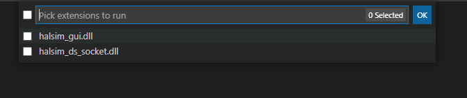
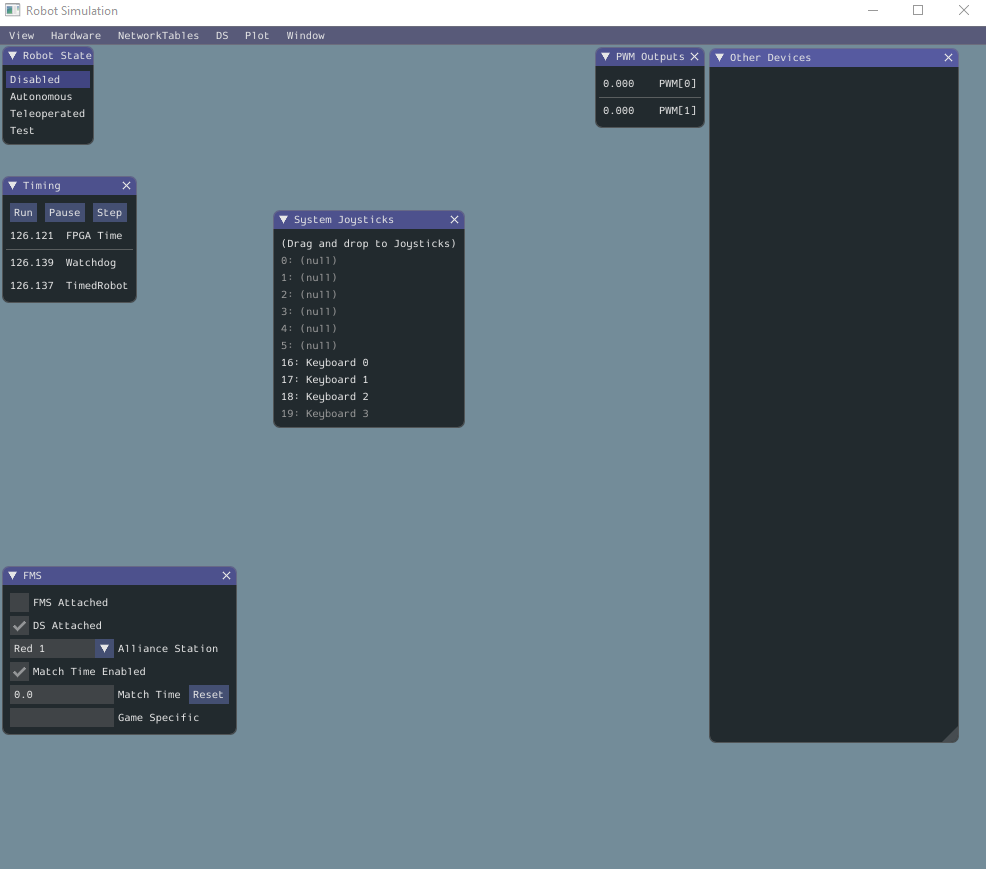
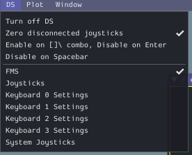
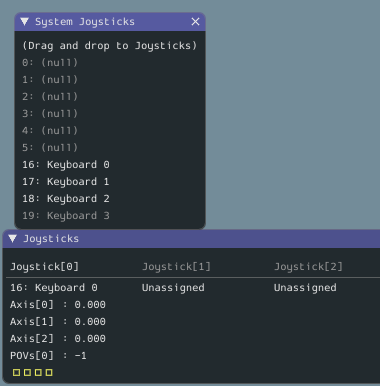
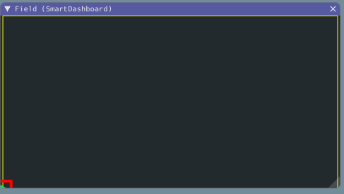

# Team 2051 Simulator Demo

Demonstration of using the WPI simulator to run a simple robot.

## Overview

Simple simulation of a robot using tank drive (left and right motors) controlled by "arcade-style" controls (where the controller translates forward and back
stick motion into forward and back robot motion and left-and-right stick motion into turning counterclockwise or clockwise).

## To Use

*note*: Directions given for Windows, but should work similarly on other OSs (substitute relevant keys, like command for ctrl).

1. Install the correct version of WPILib for your system from [here](https://github.com/wpilibsuite/allwpilib/releases). Details of the install process are
   [here](https://docs.wpilib.org/en/stable/docs/zero-to-robot/step-2/wpilib-setup.html). *At the end, you should have a copy of Visual Studio Code set
   up with the WPILib directories.
2. Clone this Git repository
3. Run Visual Studio Code, and navigate to the directory you cloned (Ctrl-K O to open the directory navigator).
4. Once Visual Studio Code opens, run the simulator by hitting Ctrl-Shift-P and selecting the option "WPILib: Simulate Robot Code on Desktop"
5. As the simulator boots up, keep an eye out... You should see another dialog pop open at the top of Visual Studio Code to select
   your simulator. Select "halsim_gui.dll" (*note*: this is different on different OSes; see 
   [documentation](https://docs.wpilib.org/en/stable/docs/software/wpilib-tools/robot-simulation/simulation-gui.html) for details).

   
6. After selecting your simulator, the Robot Simulation window will come up. Here, you can set up your simulator and test-drive the robot!

   

## Setting up the simulator

### Choosing a joystick

To bind a joystick to the inputs the robot expects:

1. Under the "DS" menu (driver's station), select the "Joysticks" menu option to show the Joystick window. This lists all the things acting
   like joysticks for the robot. They will all be "Unassigned"
   
   

2. Under the same menu, select the "System Joystics" menu option to see a list of all the things plugged into your computer that could act like
   a joystick.
3. To use a joystick, pick something in "System Joysticks" and click-and-drag it to Joystick[0] in the "Joysticks" window.

   
4. If you picked a keyboard, you can change the keybindings by choosing "Keyboard (0, 1, 2, or 3) Settings" from the "DS" menu. By default,
   two joystick axes are bound to WS and AD, giving you WASD ("Doom-style") controls.

### Opening the Field view

To see the robot on the "field":

1. Under the "NetworkTables" menu, select "SmartDashboard > Field". 
2. The robot starts in the bottom-left of the field, represented by the green arrow in a red box.

   

### Driving the robot

The robot starts disabled, so it won't drive. To drive, select "Teleoperated" from the "Robot State" panel near the top-left.

Once enabled, you should be able to use the joystick to move the robot around the simulated field!

## Follow-up work

* It is possible to load an image for both the field and the robot and some field parameters into the display 
  ([see docs](https://docs.wpilib.org/en/stable/docs/software/wpilib-tools/robot-simulation/simulation-gui.html)). Change the image and get
  some obstacles to drive around!
* The robot's physics model is simple to the point of being unrealistic; robot will stop on a dime when power is cut to the motors and
  never skids. It could be fun to replace the logic in `SimpleSimulatedChassis` with something more exciting.
  
## High-level overview

The simulated robot basically works by mapping the commands going to the speed controllers to a simulation that is fed to the 
simulator dashboard via NetworkTables. The simulator has these parts (wired together in `Robot.java`):

* `Field2d m_field`: The field representation. This takes in `Pose2d` descriptions of the robot position and rotation and ships
  them to the dashboard via NetworkTables.
* `SimpleSimulatedChassis m_chassis`: A little widget that keeps track of an imaginary position and rotation for the robot on the field.

These are set up in `simulationInit`, which is only run when the robot code is in simulation mode (so should be ignored
if the code runs on the real robot). Another method that only runs in simulation, `simulationPeriodic`, gets called
frequently. In here, we do two things:

1. Call `m_chassis.updatePose` on the chassis, giving it the leftMotor and rightMotor so it knows how the robot's position should be changing.
   `updatePose` changes the robot position and rotation based on the motor commands.
2. Call `m_field.setRobotPose`, which communicates the new pose back to the dashboard.
